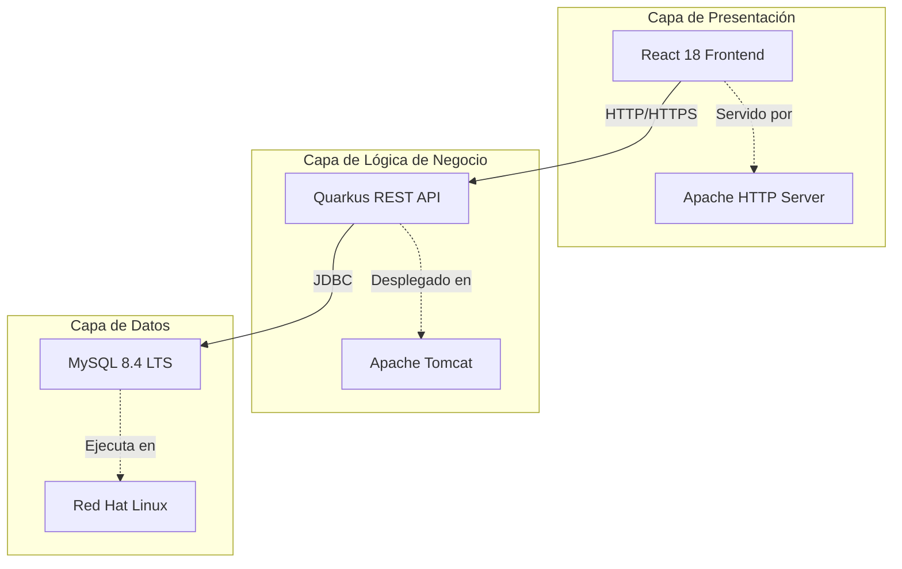
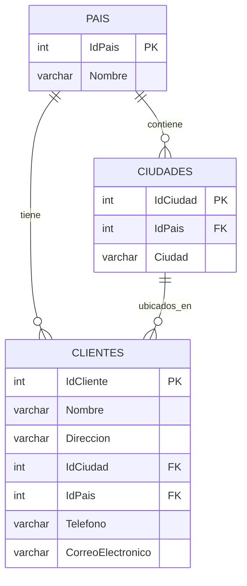
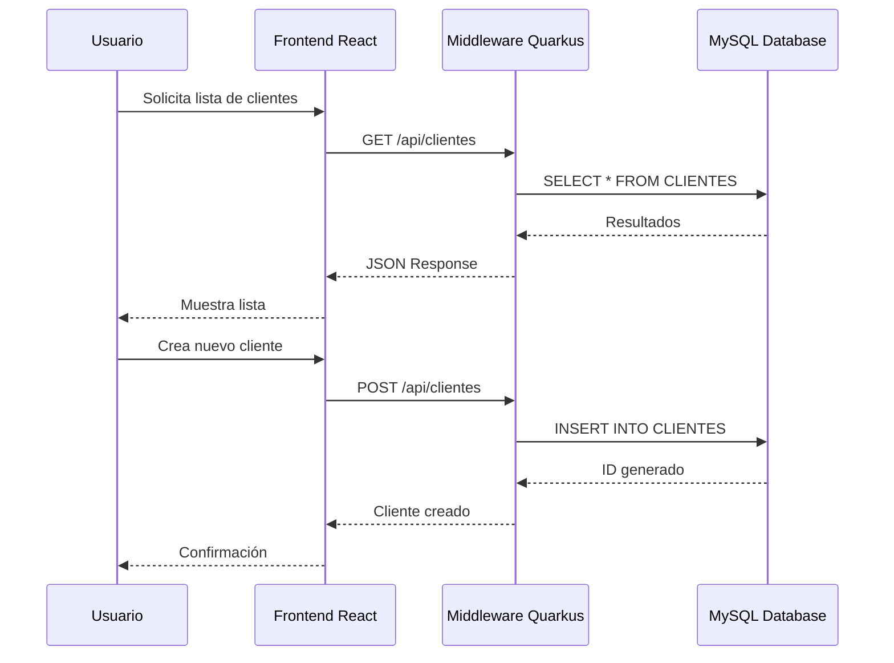

# Plan de Implementación - Sistema de Gestión de Clientes (3 Capas)

## Resumen del Proyecto

Aplicación de 3 capas para gestión de datos de clientes con:
- **Backend**: MySQL 8.4 LTS en Red Hat Linux
- **Middleware**: Quarkus 3.x con Java 21 LTS en Apache Tomcat
- **Frontend**: React 18.x en Apache HTTP Server

## Arquitectura del Sistema



## Modelo de Datos



## Estructura del Proyecto

```
customer-management-app/
├── backend/
│   ├── sql/
│   │   ├── 01-create-tables.sql
│   │   ├── 02-insert-paises.sql
│   │   └── 03-insert-ciudades.sql
│   └── scripts/
│       └── install-mysql-redhat.sh
├── middleware/
│   ├── src/
│   │   └── main/
│   │       ├── java/
│   │       │   └── com/
│   │       │       └── customerapp/
│   │       │           ├── entity/
│   │       │           ├── repository/
│   │       │           ├── service/
│   │       │           └── resource/
│   │       └── resources/
│   │           └── application.properties
│   ├── pom.xml
│   └── scripts/
│       └── install-tomcat.sh
├── frontend/
│   ├── public/
│   ├── src/
│   │   ├── components/
│   │   │   ├── clientes/
│   │   │   ├── ciudades/
│   │   │   └── paises/
│   │   ├── services/
│   │   └── App.js
│   ├── package.json
│   └── scripts/
│       └── install-apache.sh
└── docs/
    ├── INSTALLATION.md
    └── API.md
```

## Especificaciones Técnicas

### Backend (Base de Datos)

**Tecnologías:**
- MySQL 8.4 LTS
- Red Hat Enterprise Linux

**Tablas:**

1. **PAIS**
   - IdPais: INT AUTO_INCREMENT PRIMARY KEY
   - Nombre: VARCHAR(50) NOT NULL

2. **CIUDADES**
   - IdCiudad: INT AUTO_INCREMENT PRIMARY KEY
   - IdPais: INT NOT NULL (FK → PAIS)
   - Ciudad: VARCHAR(50) NOT NULL

3. **CLIENTES**
   - IdCliente: INT AUTO_INCREMENT PRIMARY KEY
   - Nombre: VARCHAR(50) NOT NULL
   - Direccion: VARCHAR(50)
   - IdCiudad: INT (FK → CIUDADES)
   - IdPais: INT (FK → PAIS)
   - Telefono: VARCHAR(14)
   - CorreoElectronico: VARCHAR(50)

**Datos Iniciales:**
- 5 países: Argentina, Chile, Uruguay, Paraguay, Brasil
- 10 ciudades principales por país (50 ciudades totales)

### Middleware (API REST)

**Tecnologías:**
- Java 21 LTS (OpenJDK)
- Quarkus 3.x
- Apache Tomcat
- Hibernate ORM con Panache
- RESTEasy Reactive

**Endpoints API:**

**Clientes:**
- `GET /api/clientes` - Listar todos
- `GET /api/clientes/{id}` - Obtener por ID
- `GET /api/clientes/buscar?q={query}` - Búsqueda
- `POST /api/clientes` - Crear nuevo
- `PUT /api/clientes/{id}` - Actualizar
- `DELETE /api/clientes/{id}` - Eliminar

**Ciudades:**
- `GET /api/ciudades` - Listar todas
- `GET /api/ciudades/{id}` - Obtener por ID
- `GET /api/ciudades/pais/{idPais}` - Por país
- `POST /api/ciudades` - Crear nueva
- `PUT /api/ciudades/{id}` - Actualizar
- `DELETE /api/ciudades/{id}` - Eliminar

**Países:**
- `GET /api/paises` - Listar todos
- `GET /api/paises/{id}` - Obtener por ID
- `POST /api/paises` - Crear nuevo
- `PUT /api/paises/{id}` - Actualizar
- `DELETE /api/paises/{id}` - Eliminar

### Frontend (Interfaz Web)

**Tecnologías:**
- React 18.x
- Node.js 20 LTS (para desarrollo)
- Apache HTTP Server (producción)
- Axios (cliente HTTP)
- React Router (navegación)

**Componentes Principales:**

1. **Gestión de Clientes**
   - ClientesList: Lista con búsqueda y filtros
   - ClienteForm: Formulario crear/editar
   - ClienteDetail: Vista detallada

2. **Gestión de Ciudades**
   - CiudadesList: Lista de ciudades
   - CiudadForm: Formulario crear/editar

3. **Gestión de Países**
   - PaisesList: Lista de países
   - PaisForm: Formulario crear/editar

**Funcionalidades:**
- CRUD completo para Clientes, Ciudades y Países
- Búsqueda de clientes por nombre, email, teléfono
- Validación de formularios
- Manejo de errores
- Interfaz responsive

## Flujo de Datos



## Consideraciones de Seguridad

1. **Base de Datos:**
   - Usuario MySQL con permisos limitados
   - Conexiones solo desde IP del middleware
   - Contraseñas seguras

2. **Middleware:**
   - Validación de entrada en todos los endpoints
   - Manejo de excepciones SQL
   - CORS configurado para frontend específico

3. **Frontend:**
   - Validación de formularios
   - Sanitización de entrada de usuario
   - HTTPS en producción

## Requisitos del Sistema

### Backend Server
- Red Hat Enterprise Linux 8/9
- 2GB RAM mínimo
- 20GB espacio en disco
- MySQL 8.4 LTS

### Middleware Server
- Linux/Windows Server
- 4GB RAM mínimo
- Java 21 LTS
- Apache Tomcat 10.x

### Frontend Server
- Linux/Windows Server
- 2GB RAM mínimo
- Apache HTTP Server 2.4
- Node.js 20 LTS (desarrollo)

## Próximos Pasos

Una vez aprobado este plan, se procederá a:

1. Crear todos los scripts SQL y de instalación
2. Desarrollar el middleware Quarkus con todas las APIs
3. Implementar el frontend React con todos los componentes
4. Generar documentación completa de instalación y uso
5. Preparar scripts de despliegue para cada capa

¿Estás de acuerdo con este plan? ¿Hay algo que te gustaría modificar o agregar?
